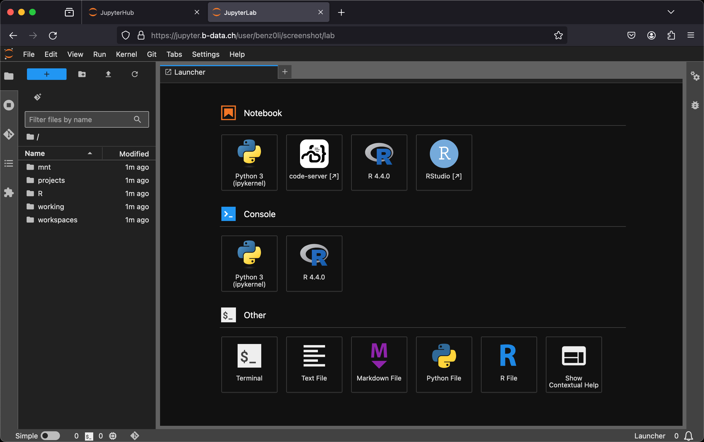

# Jupyter

<!-- markdownlint-disable line-length -->
  
<!-- markdownlint-enable line-length -->

[This project](https://gitlab.com/b-data/docker/deployments/jupyter) serves as a
template to run [jupyterhub](https://gitlab.b-data.ch/jupyterhub/jupyterhub/container_registry)
with [jupyterlab/r/verse](https://gitlab.b-data.ch/jupyterlab/r/verse/container_registry)
in docker containers using docker compose.  
ℹ️ For JupyterHub on a cloud/on-premise k8s environment, see Jupyter's
[Zero to JupyterHub with Kubernetes](https://z2jh.jupyter.org).

Features:

* **JupyterHub**: A multi-user Hub which spawns, manages, and proxies multiple
  instances of the single-user JupyterLab server.
  * **PostgreSQL** database to store information about users, services, and
    other data needed for operating the Hub.
* **JupyterLab**: A web-based interactive development environment for Jupyter
  notebooks, code, and data. The custom Docker image includes
  * **code-server**: [`Code - OSS`](https://github.com/microsoft/vscode) in the
    browser.
  * **Git**: A distributed version-control system for tracking changes in source
    code.
  * **Git LFS**: A Git extension for versioning large files.
  * **Pandoc**: A universal markup converter.
  * **Python**: An interpreted, object-oriented, high-level programming language
    with dynamic semantics.
  * **Quarto**: A scientific and technical publishing system built on Pandoc.
  * **R**: A language and environment for statistical computing and graphics.
  * **radian**: An alternative console for R with multiline editing and rich
    syntax highlight.
  * **RStudio**: An integrated development environment (IDE) for R.
  * **TinyTeX**: A lightweight, cross-platform, portable, and easy-to-maintain
    LaTeX distribution based on TeX Live.
  * **Zsh**: A shell designed for interactive use, although it is also a
    powerful scripting language.
* Pre-configured to run at a **subdomain** (default: jupyter) of your
  **own domain**.
* Use of environment files for variable substitution in the Compose file.

The following extensions are pre-installed for **code-server**:

* [.gitignore Generator](https://github.com/piotrpalarz/vscode-gitignore-generator)
* [EditorConfig](https://open-vsx.org/extension/EditorConfig/EditorConfig)
* [Git Graph](https://open-vsx.org/extension/mhutchie/git-graph)
* [GitHub Pull Requests and Issues](https://open-vsx.org/extension/GitHub/vscode-pull-request-github)
* [GitLab Workflow](https://open-vsx.org/extension/GitLab/gitlab-workflow)
* [GitLens — Git supercharged](https://open-vsx.org/extension/eamodio/gitlens)  
  :information_source: Pinned to version 11.7.0 due to unsolicited AI content
* [Excel Viewer](https://open-vsx.org/extension/GrapeCity/gc-excelviewer)
* [Jupyter](https://open-vsx.org/extension/ms-toolsai/jupyter)
* [LaTeX Workshop](https://open-vsx.org/extension/James-Yu/latex-workshop)
* [markdownlint](https://open-vsx.org/extension/DavidAnson/vscode-markdownlint)
* [Path Intellisense](https://open-vsx.org/extension/christian-kohler/path-intellisense)
* [Project Manager](https://open-vsx.org/extension/alefragnani/project-manager)
* [Python](https://open-vsx.org/extension/ms-python/python)
* [Quarto](https://open-vsx.org/extension/quarto/quarto)
* [R](https://open-vsx.org/extension/Ikuyadeu/r)
* [YAML](https://open-vsx.org/extension/redhat/vscode-yaml)

About:

* **JupyterHub**
  * Homepage: <https://jupyter.org/hub>
  * Documentation: <https://jupyterhub.readthedocs.io/en/stable/>
* **JupyterLab**
  * Homepage: <https://jupyter.org>
  * Documentation: <https://jupyterlab.readthedocs.io/en/stable/>
* **code-server**
  * Homepage: <https://github.com/cdr/code-server>
* **Git**
  * Homepage: <https://git-scm.com>
  * Documentation: <https://git-scm.com/docs>
* **Git LFS**
  * Homepage: <https://git-lfs.github.com>
  * Documentation: <https://github.com/git-lfs/git-lfs/tree/main/docs>
* **Pandoc**
  * Homepage: <https://pandoc.org>
  * Manual: <https://pandoc.org/MANUAL.html>
* **Python**
  * Homepage: <https://www.python.org>
  * Documentation: <https://docs.python.org>
* **Quarto**
  * Homepage: <https://quarto.org>
  * Reference: <https://quarto.org/docs/reference/>
* **R**
  * Homepage: <https://www.r-project.org>
  * Manuals: <https://cran.r-project.org/manuals.html>
* **radian**
  * Homepage: <https://github.com/randy3k/radian>
* **RStudio**
  * Homepage: <https://posit.co/products/open-source/rstudio-server>
  * User Guide: <https://docs.posit.co/ide/user/>
* **TinyTeX**
  * Homepage: <https://yihui.org/tinytex/>
* **Zsh**
  * Homepage: <http://zsh.sourceforge.net>
  * Documentation: <http://zsh.sourceforge.net/Doc/Release/zsh_toc.html>

## Table of Contents

* [Prerequisites](#prerequisites)
* [Install](#install)
* [Usage](#usage)
* [Further reading](#further-reading)
* [Similar projects](#similar-projects)
* [Contributing](#contributing)
* [License](#license)
* [Trademarks](#trademarks)

## Prerequisites

The following is required:

* A DNS record for **subdomain** (default: jupyter) pointing to this host.

## Install

This project depends on the following
[Docker Deployments](https://gitlab.com/b-data/docker/deployments):

* [Træfik](https://gitlab.com/b-data/docker/deployments/traefik): TLS
  termination, reverse proxy
* [GitLab CE](https://gitlab.com/b-data/docker/deployments/gitlab-ce):
  Authentication

## Usage

1. Create an external docker network named "jupyter":  

       docker network create jupyter

1. Make a copy of all `sample.` files and folders:  

       for file in sample.*; do cp -r "$file" "${file#sample.}"; done;

1. Update environment variables `JH_DOMAIN`, `GL_DOMAIN` and
   `JH_CERTRESOLVER_NAME` in '.env':
    * Replace `mydomain.com` with your **own domain** that serves the
      **subdomain**.
    * Replace `mydomain-com` with a valid certificate resolvers name of Træfik.
1. Set environment variable `JH_COOKIE_SECRET` in '.env':  
   Generate random cookie secret:  

       openssl rand -hex 32

1. [Add JupyterHub as an OAuth application](https://docs.gitlab.com/ee/integration/oauth_provider.html#oauth-applications-in-the-admin-area)
   in GitLab CE:  

       Name: JupyterHub
       Redirect URL: https://jupyter.mydomain.com/hub/oauth_callback

    → Replace `mydomain.com` with your **own domain** that serves the
    **subdomain**.
    * Tick "Trusted"
    * Scopes:
        * Tick "api"
    * Click "Submit" and copy "Application ID" and "Secret"
1. Update environment variables `JH_GITLAB_APPLICATION_ID` and
   `JH_GITLAB_SECRET` in '.env' accordingly.
1. Update the following environment variable in 'db.env':
    * `POSTGRES_PASSWORD`: Superuser password for PostgreSQL (default:
      `password`)
1. Start the container in detached mode:  

      docker compose up -d

### Test

Wait a moment and visit <https://jupyter.mydomain.com> to confirm everything
went fine.

### Reference deployment

Check out the reference deployment at <https://demo.jupyter.b-data.ch>.
<!-- markdownlint-disable line-length -->
* [Security Analysis](https://www.immuniweb.com/websec/demo.jupyter.b-data.ch/DtC46JBM/)  
  

<b>Details</b>

  

      ImmuniWeb® Community Edition: Website Security Test

      Target: https://demo.jupyter.b-data.ch
      IP Address: Not specified

      Test completed

      Source URL: https://demo.jupyter.b-data.ch
      Tested URL: https://demo.jupyter.b-data.ch/hub/login?next=%2Fhub%2F
      Tested IP Address: 51.154.68.67
      Completed: June 10, 2024 10:35:25

      ╭───────────────────╮ ╭───────────╮ ╭───────────────────────────────╮
      │                   │ │  PCI DSS  │ │    Software Security Test     │
      │        /\         │ ╰───────────╯ ╰───────────────────────────────╯
      │       /  \        │ ╭───────────╮ ╭───────────────────────────────╮
      │      / /\ \       │ │  EU GDPR  │ │     Headers Security Test     │
      │     / ____ \      │ ╰───────────╯ ╰───────────────────────────────╯
      │    /_/    \_\     │ ╭───────────╮
      │                   │ │    CSP    │
      ╰───────────────────╯ ╰───────────╯

      Grade: A
      PCI DSS Compliance Test: 2 Issues Found
      EU GDPR Compliance Test: 3 Issues Found
      Content Security Policy Test: No Major Issues Found
      Software Security Test: 1 Issue Found
      Headers Security Test: No Major Issues Found

      HTTP Headers Security Notes:
      [Misconfiguration or Weakness] Some HTTP headers related to security and privacy are missing or misconfigured.

      Cookies Security Notes:
      [Misconfiguration or Weakness] Some cookies have missing secure flags or attributes.

  

  

* [SSL Security Test](https://www.immuniweb.com/ssl/demo.jupyter.b-data.ch/iIrCYOw5/)  
  

<b>Details</b>

  

      ImmuniWeb® Community Edition: SSL Security Test

      Target: demo.jupyter.b-data.ch:443
      IP Address: Not specified

      Test completed

      Tested Hostname: demo.jupyter.b-data.ch
      Tested Port: 443
      Tested IP Address: 51.154.68.67
      Completed: June 10, 2024 07:37:55

      ╭───────────────────╮ ╭───────────╮ ╭───────────────────────────────╮
      │                   │ │   HIPAA   │ │    Industry Best Practices    │
      │       /\    _     │ ╰───────────╯ ╰───────────────────────────────╯
      │      /  \ _| |_   │ ╭───────────╮
      │     / /\ \_   _|  │ │    NIST   │
      │    / ____ \|_|    │ ╰───────────╯
      │   /_/    \_\      │ ╭───────────╮
      │                   │ │  PCI DSS  │
      ╰───────────────────╯ ╰───────────╯

      Grade: A+
      HIPAA Compliance Test: No Major Issues Found
      NIST Compliance Test: No Major Issues Found
      PCI DSS Compliance Test: Compliant
      Industry Best Practices: No Issues Found

      Notes:
      [Good configuration] The server supports the most recent and secure TLS protocol version of TLS 1.3.0

  

  

<!-- markdownlint-enable line-length -->

Hardened and customised to meet the latest web application security standards.

## Further reading

JupyterHub:

* [Authenticators](https://jupyterhub.readthedocs.io/en/stable/reference/authenticators.html)
* [DockerSpawner API](https://jupyterhub-dockerspawner.readthedocs.io/en/stable/api/index.html)
* [The Hub's Database](https://jupyterhub.readthedocs.io/en/stable/reference/database.html)

JupyterLab:

* [ServerProxy](https://jupyter-server-proxy.readthedocs.io/en/stable/)

## Similar projects

* [defeo/jupyterhub-docker](https://github.com/defeo/jupyterhub-docker)

## Contributing

PRs accepted. Please submit to the
[GitLab repository](https://gitlab.com/b-data/docker/deployments/jupyter).

This project follows the
[Contributor Covenant](https://www.contributor-covenant.org)
[Code of Conduct](CODE_OF_CONDUCT.md).

## License

Copyright © 2020 b-data GmbH

Distributed under the terms of the [MIT License](LICENSE).

## Trademarks

RStudio® is a trademark of Posit Software, PBC, all rights reserved, and may be
registered in the United States Patent and Trademark Office and in other
countries.

The use of the trademarked term RStudio® and the distribution of the RStudio
binaries through the images hosted on b-data's GitLab Container Registry
(`glcr.b-data.ch`) has been granted by explicit permission of Posit Software,
PBC. Please review
[Posit’s Trademark Guidelines](https://posit.co/about/trademark-guidelines/) and
address inquiries about further distribution to
[permissions@posit.co](mailto:permissions@posit.co).
